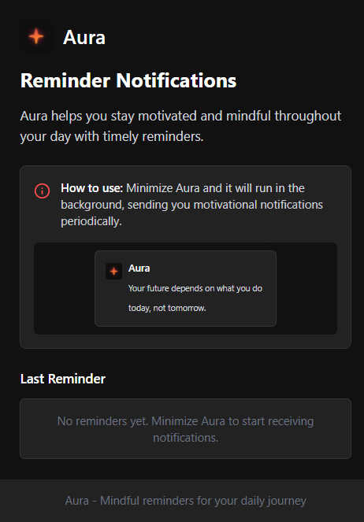
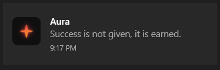

<div align="center">
  <div style="display: flex; align-items: center; justify-content: center;">
      
    <h1 style="margin-left: 20px;">Aura</h1>
  </div>
  
  <p><em>Mindful reminders for your daily journey</em></p>

  <!-- Badges -->


</div>

## ✨ About

Aura is a minimalist notification reminder application that helps you stay motivated and mindful throughout your day. It runs quietly in the background, sending you timely reminders and inspirational messages when you need them most.

> **"WHY NOT YOU?"**

This simple question lies at the heart of Aura, encouraging you to recognize your potential and embrace opportunities for growth.

**Note:** This is the desktop version of Aura. The original mobile application can be found at [Aura](https://www.instagram.com/the_aura_app/).

## 🌟 Features

- **Unobtrusive Notifications** - Receive gentle reminders without disrupting your workflow
- **Motivational Messages** - Curated collection of inspiring quotes and reminders
- **Minimal Interface** - Clean, distraction-free design that stays out of your way
- **Background Operation** - Runs silently while you focus on what matters
- **Desktop Experience** - Optimized for your computer workflow, complementing the mobile experience

## 📸 Screenshots

<div align="center">
  
  <p><em>The main Aura desktop interface</em></p>
  
  <br />
  
  
  <p><em>An Aura notification appearing on your desktop</em></p>
</div>

## 🚀 Installation

```bash
# Clone the repository
git clone https://github.com/Mafifa/aura-app.git

# Navigate to the project directory
cd aura-app

# Install dependencies
npm install

# Start the application
npm start
```
